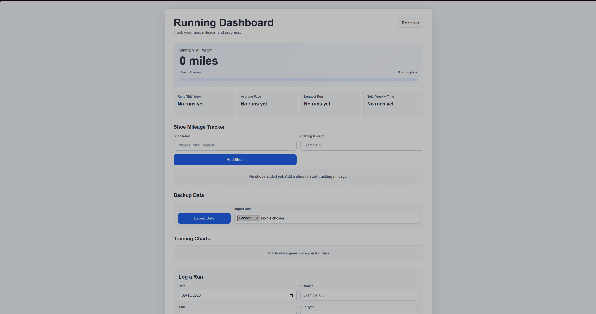
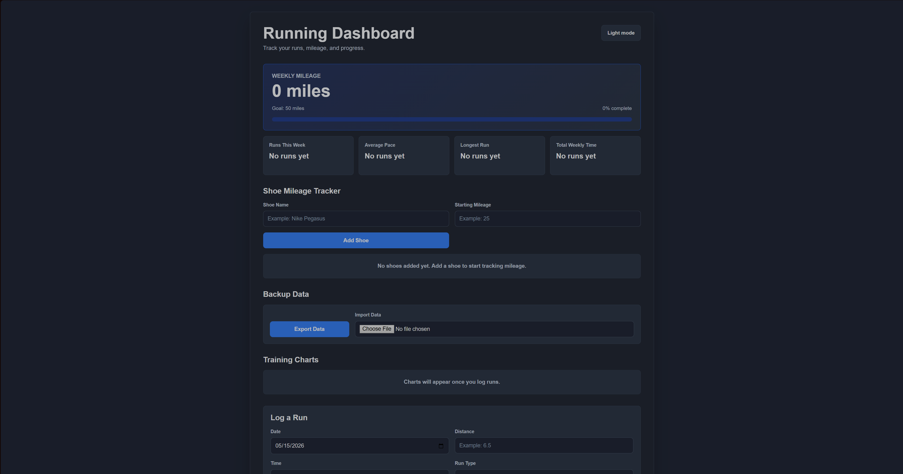
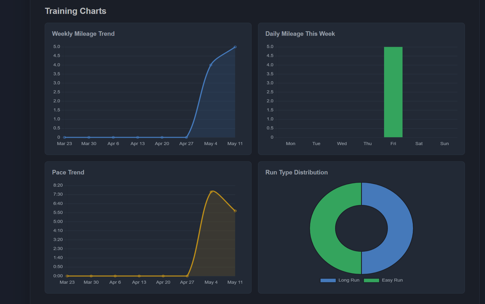
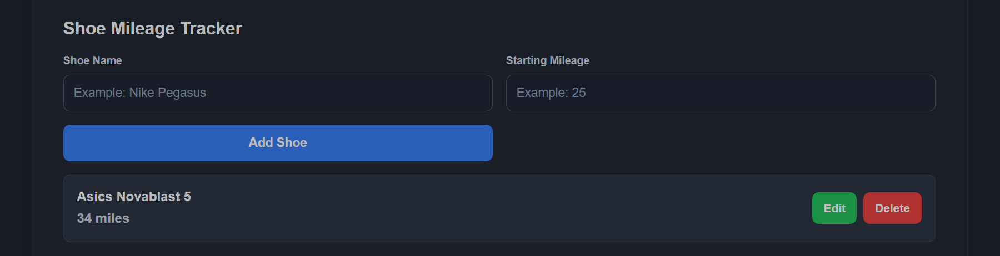

# Running Dashboard

A browser-based training dashboard built with HTML, CSS, and JavaScript.

## Features

- Add, edit, and delete runs
- Weekly mileage tracking
- Pace calculations
- Charts and analytics
- Dark mode
- Shoe mileage tracking
- Import/export data
- Mobile responsive design

## Screenshots

### Light Mode

### Dark Mode

### Charts

### Shoe Tracking

## Tech Stack

- HTML
- CSS
- JavaScript
- Chart.js
- localStorage

## What I Learned

- DOM manipulation
- JavaScript modules
- localStorage persistence
- Array methods like map/filter/reduce
- Chart data transformation
- Event handling
- Frontend architecture

## Future Improvements

- React rebuild
- Database integration
- User accounts
- More advanced analytics

## Live Demo

[View the live project](https://6a079ca542a1b30e925502cc--magnificent-praline-df2040.netlify.app)